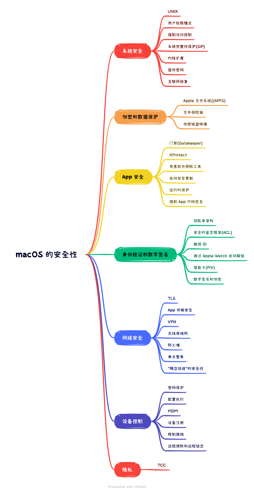

# macOS安全机制

## 安全性概述
在[macOS的安全性概述](https://www.apple.com.cn/business/docs/resources/macOS_Security_Overview.pdf)中，macOS的安全性由以下部分组成：



最新的概述可以翻阅：[Apple 平台安全保护](https://support.apple.com/zh-cn/guide/security/welcome/web)，改动并不是很大，巴斯这里将红队关注的点重新罗列整理。

## 系统完整性保护SIP

系统完整性保护是一项安全技术，旨在协助防止潜在恶意软件修改 Mac 上受保护的文件和文件夹。系统完整性保护可以限制 root 用户帐户，以及 root 用户能够在 Mac 操作系统的受保护部分执行的操作。

在尚未采用系统完整性保护（在 OS X El Capitan(10.11) 中开始引入）之前，root 用户没有任何权限限制，因此它可以访问 Mac 上的任何系统文件夹或 App。如果你在安装软件时输入了管理员用户名和密码，这个软件就能获得 root 级访问权限。这样使软件能够修改或覆盖任意系统文件或 App。

系统完整性保护包含对以下系统部分的保护：

- /System
- /usr
- /bin
- /sbin
- /var
- 系统预装的App

第三方应用程序和安装程序可以针对以下路径和 App 继续完成写入操作：

- /Applications
- /Library
- /usr/local

仅当进程拥有 Apple 签名并拥有对系统文件（如 Apple 软件更新和 Apple 安装程序）完成写入操作的特殊授权时，系统完整性保护才会允许它修改这些受保护部分。从 App Store 下载的 App 兼容系统完整性保护。升级至 OS X El Capitan(10.11)或更高版本时，与系统完整性保护冲突的其他第三方软件可能会被忽略。

### 关闭/开启SIP
> https://appstorrent.ru/510-sip.html

命令备忘录📕：
```bash
$ csrutil enable                # 启用SIP
$ csrutil disable               # 停用SIP
$ csrutil enable --without fs   # 仅禁用文件系统，而不会影响內核扩展或干扰NVRAM
$ csrutil status                # 查看SIP开启状态
```

## Gatekeeper
Gatekeeper安全技术，其设计旨在帮助确保仅受信任的软件可在用户的 Mac 上运行。当用户从 `App Store` 之外的地方下载并打开 App、插件或安装软件包时，Gatekeeper会验证该软件是否来自可识别的开发者、经过 Apple 公证不含已知的恶意内容且未被修改。在首次打开下载的软件之前，门禁还会请求用户批准，以确保用户没有被诱骗运行他们认为只是数据文件的可执行代码。

[在 Mac 上安全地打开 App](https://support.apple.com/zh-cn/HT202491)文章中可以看到 Gatekeeper 各种提示作用。

### 查看&清除文件隔离标识
命令备忘录📕：
```bash
$ xattr File                            # 查看所有属性标识
$ xattr -p com.apple.quarantine File    # 查看是否有隔离属性标识
$ xattr -rd com.apple.quarantine File   # 清除文件隔离标识
$ xattr -rc File                        # 清除文件隔离标识
```
### Gatekeeper Bypass

#### CVE-2021–30657
- 系统版本：macOS Catalina(10.15) ～ Big Sur(11.3)
- 文章：https://cedowens.medium.com/macos-gatekeeper-bypass-2021-edition-5256a2955508
- 漏洞根因剖析文章：https://objective-see.org/blog/blog_0x64.html

此漏洞利用Bash脚本替换`Some.App/Contents/MacOS/`Bundle中之前 macho 文件绕过 Gatekeeper 检测。

## XPortect
macOS 内建了称为 XProtect 的防病毒技术，可基于签名检测和移除恶意软件。系统使用由 Apple 定期更新的 YARA 签名，YARA 是一款用来基于签名检测恶意软件的工具。Apple 会监视新的恶意软件感染和威胁，并自动更新签名（独立于系统更新），以保护 Mac 免受恶意软件侵害。XProtect 会自动检测已知恶意软件并阻止其执行。在 macOS 10.15 或更高版本中，XProtect 会在以下操作执行时检查是否含已知的恶意内容：

- App 首次启动
- App 发生更改（在文件系统中）
- XProtect 签名发生更新

XProtect 检测到已知的恶意软件时，会阻止软件并通知用户，还提供将软件移到废纸篓的选项。

>【注】公证对已知文件（或文件哈希）有效，并可用在之前启动过的 App 上。XProtect 基于签名的规则比特定文件哈希更为通用，因此它可以找到 Apple 未发现过的变体。XProtect 只扫描发生更改或首次启动的 App。

如果恶意软件已侵入 Mac，XProtect 还包含修复感染的技术。例如，它包括的引擎可基于 Apple 自动发布的更新（作为系统数据文件自动更新和安全性更新的一部分）来修复感染。它还会在收到更新信息后立即移除恶意软件，并继续定期检查是否感染。XProtect 不会自动重新启动 Mac。

### Yara规则提取
- `/System/Library/CoreServices/XProtect.bundle/Contents/Resources/XProtect.yara XProtect.yara`
- `/Library/Apple/System/Library/CoreServices/XProtect.bundle/Contents/Resources/XProtect.yara XProtect.yara` (on m1 or a newer version)

## 代码签名
> 摘自 《macOS软件安全与逆向分析》 - 2.5.2代码签名

代码签名是一种对软件完整性检查、软件作者身份识别的技术，旨在确保它们不会被篡改或修改。在 macOS 10.15 中，不在 App Store 中分发的所有 App 必须由开发者使用 Apple 签发的开发者 ID 证书（和专用密钥）进行签名并由 Apple 公证，以便在默认的 "Gatekeeper" 设置中运行。

代码签名使用现代密码学技术，依赖于x.509标准的公开密钥加密算法，对软件的代码进行数字签名。macOS平台的软件开发者向苹果应用商店提交的应用软件都必领事先经过代码签名代码签名需要用到向苹果公司申请开发者资格时申请到的证书。证书中包含了私钥、公钥、颁发者以及开发人员的一些信息。这些信息使用KeyChain存储在 macOS 系统中。可以通过打开 KeyChain Access 来查看本机的开发者证书信息。下面列出一些常用命令：

命令备忘录📕：
```bash
$ security list-keychains                       # 列出系统中所有的keychain
$ security dump-keychain                        # 转储keychain中的内容
$ security find-identity -v -p codesigning      # 查看本机开发者证书信息
$ security find-generic-password -wa 'Chrome'   # 搜索通用密码项
```

签名的过程使用命令行工具codesign完成。除了对二进制应用进行签名外，codesign还可以
对动态库、脚本以及macos软件包中的所有资源进行签名。使用xcode编译一个应用时，在应用
构建完成后会自动调用codesign进行签名，也可以使用如下命令对应用进行手动签名。

命令备忘录📕：
```bash
$ codesign -s "example ..." File                        # 签名
$ codesign -f -s "example ..." File                     # 重签名
$ codesign --options runtime -s "example ..." Foo.app   # 签名并设置强化运行时
$ codesign --remove-signature File                      # 移除签名
$ codesign -dvvv File                                   # 查看签名详细信息
$ codesign -d --entitlements - File                     # 查看已签名应用权限信息
$ sudo codesign --force --deep --sign - Foo.app         # 强制签名
```

## 参考链接
- [macOS的安全性](https://www.apple.com.cn/business/docs/resources/macOS_Security_Overview.pdf)
- [Apple 平台安全保护](https://support.apple.com/zh-cn/guide/security/welcome/web)
- [关于Mac上的系统完整性保护](https://support.apple.com/zh-cn/HT204899)
- [appstorrent-SIP](https://appstorrent.ru/510-sip.html)
- [System Integrity Protection Guide](https://developer.apple.com/library/archive/documentation/Security/Conceptual/System_Integrity_Protection_Guide/Introduction/Introduction.html#//apple_ref/doc/uid/TP40016462-CH1-DontLinkElementID_15)
- [macOS 中的门禁和运行时保护](https://support.apple.com/zh-cn/guide/security/sec5599b66df/web)
- [在 Mac 上安全地打开 App](https://support.apple.com/zh-cn/HT202491)
- [appstorrent-Gatekeeper](https://appstorrent.ru/65-gatekeeper.html)
- [在 macOS 中防范恶意软件](https://support.apple.com/zh-cn/guide/security/sec469d47bd8/web)
- [macOS 中的 App 代码签名进程](https://support.apple.com/zh-cn/guide/security/sec3ad8e6e53/web)
- [apple-CodeSigningGuide](https://developer.apple.com/library/archive/documentation/Security/Conceptual/CodeSigningGuide/AboutCS/AboutCS.html)
- [《macOS软件安全与逆向分析》 - 2.5.2代码签名](https://book.douban.com/subject/27088100/)
- [Explainer: Keychain basics](https://eclecticlight.co/2022/10/15/explainer-keychain-basics/)