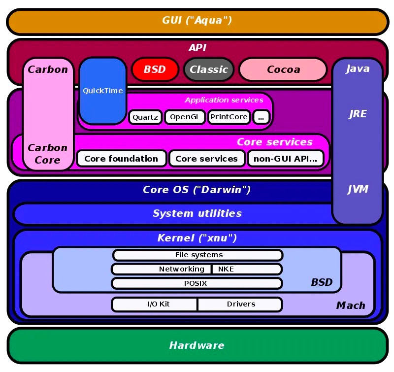

# macOS系统概述

[macOS-wiki](https://zh.m.wikipedia.org/zh-hans/MacOS) 上讲的挺好，巴斯就借用这个图梳理一下 bsd、mach、xun、darwin、macOS 之间的关系：

- `Unix`：一种多用户、多进程的计算机操作系统，源自于从20世纪70年代开始在美国AT&T公司的贝尔实验室开发的AT&T Unix([更多](https://zh.m.wikipedia.org/zh-hans/UNIX))。
- `BSD`：(Berkeley Software Distribution)的缩写，是一个衍生自Unix（类Unix）的操作系统。
- `Mach`：是一个由卡内基梅隆大学开发的计算机作业系统微内核，为了用于作业系统之研究，特别是在分布式与并行运算上([更多](https://zh.m.wikipedia.org/zh-hans/Mach))。
- `Xun`：(X is Not Unix)的缩写，XNU是一个混合内核，将宏内核与微内核两者的特性兼收并蓄，以期同时拥有两种内核的优点————比如在微内核中提高操作系统模块化程度以及让操作系统更多的部分接受内存保护的消息传递机制，和宏内核在高负荷下表现的高性能([更多](https://zh.m.wikipedia.org/zh-hans/XNU))。
- `Darwin` 是一种类 Unix 作业系统，包含开放原始码的 XNU 内核，其以微核心为基础的核心架构来实作 Mach，而作业系统的服务和使用者空间工具则以 BSD 为基础。类似其他类 Unix 作业系统，Darwin 也有对称多处理器的优点，高效能的网路设施和支援多种整合的档案系统([更多](https://zh.m.wikipedia.org/zh-hans/Darwin_(%E6%93%8D%E4%BD%9C%E7%B3%BB%E7%BB%9F)))。

macOS 包含两个主要的部分：一部分操作系统内核Darwin，基于伯克利软件套件`BSD`和`Mach`微核心的混合内核(XUN)，另一部分是 `Aqua` 的图形用户界面。