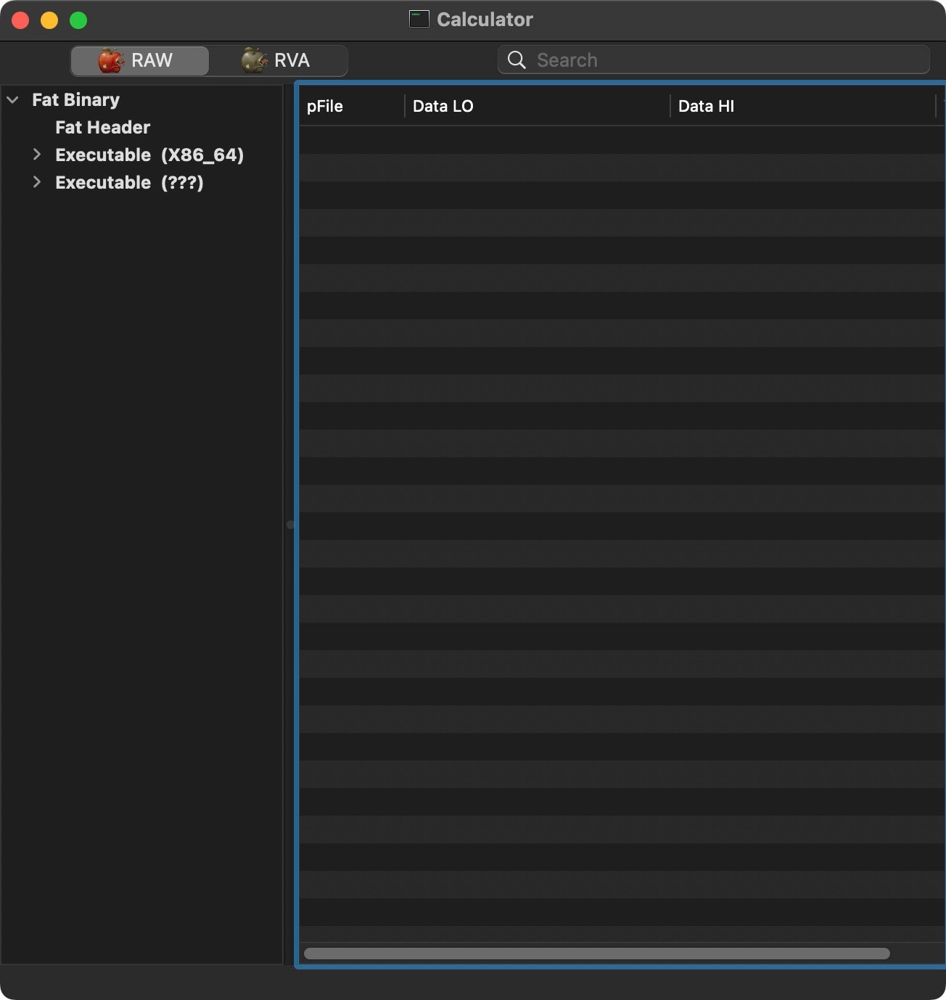
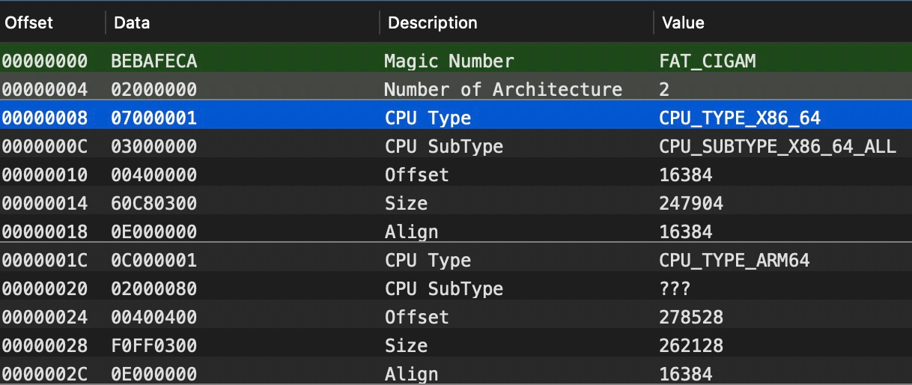
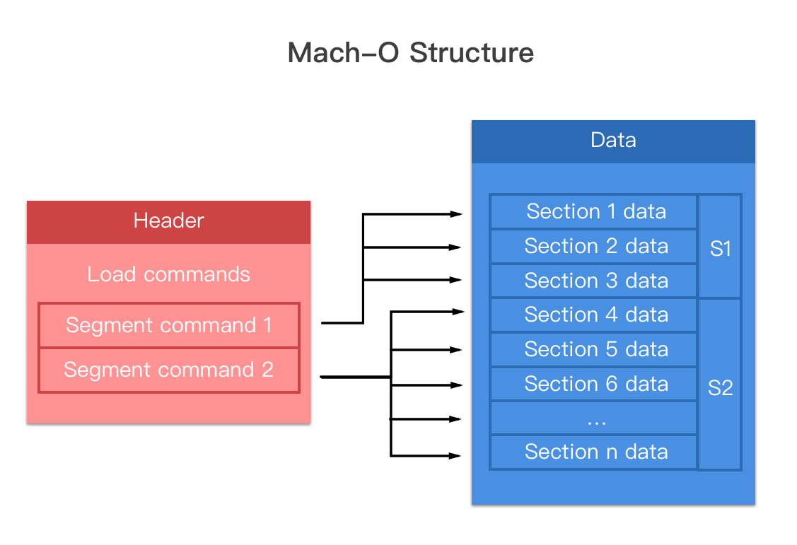

# Mach-O 文件格式

`Mach-O`是`Mach object file format`的缩写，是一种用于可执行文件、目标代码、共享库、动态加载代码和核心转储的文件格式。Mach-O 被一些基于Mach 内核的系统使用，比如NeXTSTEP、macOS和iOS。

## 分析工具

巴斯常用查看 MachO 文件格式工具是：[MachOView](https://github.com/gdbinit/MachOView)可视化工具和 otool 命令行工具。

**otool 命令备忘录📕：**
```bash
$ otool -fv file                	# 打印 fat 头信息
$ otool -hv file                	# 打印 macho 头信息
$ otool -lv file                	# 打印加载命令(Load Commands)信息
$ otool -Lv file               		# 打印使用的共享库
$ otool -V file -s __TEXT __text	# 打印对应的section内容
```

使用 `MachOView.App` 更加直观，打开 `Calculator` ：



## Fat Binary

通用二进制格式又称胖二进制格式（Fat Binary），是将多个 Mach-O 文件组合成一个多重架构的二进制文件。随着Apple Silicon的普及内置执行文件基本都变成Fat Binary：

```bash
$ file /usr/bin/otool
/usr/bin/otool: Mach-O universal binary with 2 architectures: [x86_64:Mach-O 64-bit executable x86_64
- Mach-O 64-bit executable x86_64] [arm64e:Mach-O 64-bit executable arm64e
- Mach-O 64-bit executable arm64e]
/usr/bin/otool (for architecture x86_64):	Mach-O 64-bit executable x86_64
/usr/bin/otool (for architecture arm64e):	Mach-O 64-bit executable arm64e
```

系统提供了一个命令行工具 lipo 来操作通用二进制文件。它可以添加、提取、删除以及替换通用二进制文件中特定架构的二进制版本。直接瘦身为某种架构的版本：
`$ lipo <Mach-O> -thin <架构名> -output <路径>`
也可以合并多个架构：
`$ lipo -create <Mach-O1> <Mach-O2> -output <路径>`

通用二进制的“通用”不止针对可以直接运行的可执行程序，系统中的动态库dylib、静态库.a文件以及框架等都可以是通用二进制文件，对它们也可以同样使用lipo命令来进行管理。可在`<mach-o/fat.h>`文件中找到通用二进制文件格式的声明：

```c
struct fat_header {
	uint32_t	magic;		/* FAT_MAGIC or FAT_MAGIC_64 */
	uint32_t	nfat_arch;	/* number of structs that follow */
};

struct fat_arch {
	cpu_type_t	cputype;	/* cpu specifier (int) */
	cpu_subtype_t	cpusubtype;	/* machine specifier (int) */
	uint32_t	offset;		/* file offset to this object file */
	uint32_t	size;		/* size of this object file */
	uint32_t	align;		/* alignment as a power of 2 */
};
```

MachOView查看FatHeaer: 


otool打印FatHeaer:
```bash
$ otool -fv /System/Applications/Calculator.app/Contents/MacOS/Calculator
Fat headers
fat_magic FAT_MAGIC
nfat_arch 2
architecture x86_64
    cputype CPU_TYPE_X86_64
    cpusubtype CPU_SUBTYPE_X86_64_ALL
    capabilities 0x0
    offset 16384
    size 247904
    align 2^14 (16384)
architecture arm64e
    cputype CPU_TYPE_ARM64
    cpusubtype CPU_SUBTYPE_ARM64E
    capabilities PTR_AUTH_VERSION USERSPACE 0
    offset 278528
    size 262128
    align 2^14 (16384)
```

## MachO

Mach-O文件由头(Header)、装载指令(Load Commands)和数据(Section Data)三个部分组成。



### Header
header 结构定义在 `<mach-o/loader.h>` 文件中，针对32位与64位架构的cpu，分别使用了`mach_header`与`mach_header_64`结构体来描述Mach-O头部。

```c
struct mach_header_64 {
	uint32_t	magic;		/* mach magic number identifier */
	cpu_type_t	cputype;	/* cpu specifier */
	cpu_subtype_t	cpusubtype;	/* machine specifier */
	uint32_t	filetype;	/* type of file */
	uint32_t	ncmds;		/* number of load commands */
	uint32_t	sizeofcmds;	/* the size of all the load commands */
	uint32_t	flags;		/* flags */
	uint32_t	reserved;	/* reserved */
};
```

`filetype`表示类型，常见的有:

- `MH_OBJECT`: 可重定向的目标文件
- `MH_EXECUTE`: 可执行文件
- `MH_DYLIB`: 动态绑定的共享库文件
- …

`flags`为不同的文件标签的组合，每个标签占一个位，可以用位或来进行组合，常见的标签有:

- `MH_NOUNDEFS`: 该文件没有未定义的引用
- `MH_DYLDLINK`: 该文件将要作为动态链接器的输入，不能再被静态链接器修改
- `MH_TWOLEVEL`: 该文件使用两级名字空间绑定
- `MH_PIE`: 可执行文件会被加载到随机地址(开启aslr)，只对`MH_EXECUTE`有效

### Load Commands

在mach_header之后的是Load Command加载命令，这些加载命令在Mach-O文件加载解析时，被内核加载器或者动态链接器调用，`LOAD_COMMAND` 是体现MachO文件拓展性的地方，每个 command 的头两个 word 分别表示类型和大小，如下:
```c
struct load_command {
	uint32_t cmd;		/* type of load command */
	uint32_t cmdsize;	/* total size of command in bytes */
};
```
- cmd 字段代表当前加载命令的类型
- cmdsize 字段代表当前加载命令的大小

不同的cmd类型都会有其对应的结构体来描述其内容，cmdsize表示的是整个cmd的大小，即包括头部和内容。下个`command`偏移量为：当前cmd的偏移量 + cmdsize。


加载命令类型的定义在 `<mach-o/loader.h>` 中，以 `LC_` 为前缀的；所有的这些加载命令由系统内核加载器直接使用，或由动态链接器处理。其中几个常见的加载命令有`LC_SEGMENT`、`LC_LOAD_DYLINKER`、`LC_LOAD_DYLIB`、`LC_MAIN`、`LC_CODE_SIGNATURE`、`LC_ENCRYPTION_INFO` 等。


名称                  | 含义
----------------------|-----------------------------
LC_SEGMENT_64         | 将文件中（32位或64位）的段映射到进程地址空间中
LC_DYLD_INFO_ONLY     | 动态链接相关信息
LC_SYMTAB             | 符号地址
LC_DYSYMTAB           | 动态符号表地址
LC_LOAD_DYLINKER      | 使用谁加载，我们使用dyldLC_UUID文件的UUID
LC_VERSION_MIN_MACOSX | 支持最低的操作系统版本
LC_SOURCE_VERSION     | 源代码版本
LC_MAIN               | 设置程序主线程的入口地址和栈大小
LC_LOAD_DYLIB         | 依赖库的路径，包含三方库
LC_FUNCTION_STARTS    | 函数起始地址表
LC_ENCRYPTION_INFO    | 加密的MachO的标记
LC_CODE_SIGNATURE     | 代码签名


### Section Data
> 这里简单了解下

Segment 可以理解为一段连续的内存空间，拥有对应的读/写/执行权限。从逻辑角度来看，每个段内的节存储的数据都有类似的目的。如`__TEXT` 段内存储的有汇编源代码、字符串等，`__DATA` 段内存储非常量初始化变量等。从内存管理角度来看，每个段的大小被要求是页大小的倍数，也就是 4096B 的倍数。当程序加载时，就可以正好将一个段加载到一个页内。每个Segment由一个或者多个Section组成，Section表示特定含义数据或者代码的集合(不需要页对齐)。在macOS中，通常约定segment的名称为双下划线加全大写字母(如`__TEXT`)，section的名称为双下划线加小写字母(如`__text`)。

### 加载过程
> 总结网上的资料

1. 内核空间
	(内核空间的主要任务是创建新 task 并初始化内存页和对应的权限：
	- 分配虚拟内存空间。
	- fork 进程。
	- 加载 MachO 到进程空间。
	- 加载动态链接器 dyld 并将控制权交给 dyld 处理。
2. 用户空间
	(从内核回到用户空间，便跳转到目标的入口地址开始执行动态链接阶段，进入 dyld 动态链接器：
	- 配置环境变量
	- 加载共享缓存库
	- 实例化主程序
	- 加载动态链接库
	- 链接主程序
	- 加载Load和特定的C++的构造函数方法
	- 寻找APP的main函数并调用

## 参考链接
- [wiki/Mach-O](https://en.wikipedia.org/wiki/Mach-O)
- [深入浅出MachO](https://evilpan.com/2020/09/06/macho-inside-out/)
- [apple/BundleTypes](https://developer.apple.com/library/archive/documentation/CoreFoundation/Conceptual/CFBundles/BundleTypes/BundleTypes.html#//apple_ref/doc/uid/10000123i-CH101-SW1)
- [iOS逆向(5)-不知MachO怎敢说自己懂DYLD](https://juejin.cn/post/6844903798717022222)